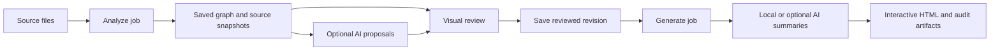

# Backend workflow and application contracts

A saved, validated `GraphDocument` is the authority for connections. Static analysis creates a draft; human edits create revisions; generation attaches summaries and presentation to a selected revision. The browser submits durable jobs and displays their saved progress. It does not own the lifetime of the work.

This design separates dependency evidence, human decisions, optional model assistance and presentation. A model never reconstructs the reviewed edge list during generation, and a browser disconnect never acts as an instruction to shut down the backend.

## Component responsibilities

| Component | Responsibility |
| --- | --- |
| `launch.py` and platform launchers | Select the Python environment, start a detached local backend, verify identity/readiness, reopen or stop the correct instance. |
| `backend/app.py` | App lifecycle, local-origin checks, health, folder selection, managed shutdown and static frontend serving. |
| `backend/workflow_jobs.py` | Persist requests, serialize queue work, report progress, reconcile commits after interruption, and require explicit retries. |
| `backend/workflow_service.py` | Coordinate analysis, edits, proposals and generation while enforcing revision and artifact rules. |
| `backend/workflow_store.py` | Store graphs, revisions, source snapshots, settings, suppression records, operation receipts and generation manifests in SQLite. |
| `backend/static_analysis.py` | Extract supported dependencies without executing the selected source or contacting a model. |
| `backend/graph_models.py` | Validate the versioned graph, evidence, identity and summary contracts. |
| `backend/project_identity.py` | Resolve an optional project name consistently for UI/API/CLI analysis, including Windows and UNC path names. |
| `backend/graph_diagnostics.py` | Present truthful coverage and grouped findings without changing the graph or suppressing evidence. |
| `backend/graph_edits.py`, `backend/drawio.py` | Validate explicit edits and the supported visual-file exchange format. |
| `backend/graph_enrichment.py` | Add optional proposed relationships or local/model description text under separate schemas. |
| `backend/model_provider.py` | Lazily initialize direct OpenAI, Azure OpenAI or local Ollama only for an opted-in operation. |
| `backend/graph_rendering.py` | Render the exact saved topology and attach summaries, evidence and review notices. |
| `frontend/api.js` | Handle transport errors, persist pending request IDs/bodies and validate scoped artifact addresses. |
| `frontend/graph-state.js`, `frontend/graph-editor.js`, `frontend/app.js` | Keep local review state, support visual editing and revision-aware recovery, and display jobs from the current launcher session. |

The obsolete extraction/rendering implementation in `backend/tools.py`, its old `backend/classes.py` schemas, old prompts and the legacy `run_da_document_workflow` entry point have been removed. Provider configuration was moved without changing its deployment or authentication flow.

## Lifecycle and durable operations



The five job kinds are `analyze`, `edit`, `import`, `suggest` and `generate`. A submission receives HTTP 202 after the request is saved. Its state is `queued`, `running`, `succeeded`, `failed` or `interrupted`. SQLite retains only the operation state needed for completion, idempotency and interruption recovery; per-run progress messages are not stored.

### Submission, ownership and recovery

- The client creates a UUID `request_id` and stores the exact request before sending it. If the response is lost, it resends that same request ID and body. The server returns the existing job. Reusing the ID for different input returns a conflict.
- One operating-system file lock owns the queue worker for a local store. A second backend using that store can read and submit jobs but remains on standby until it acquires the lock. It does not mark the live worker's jobs interrupted. The lock is released by process exit; the lock file is never deleted to manufacture a new lock.
- Each graph revision or generation commits an operation receipt in the same SQLite transaction as its authoritative result. The receipt identifies the job, draft, revision and optional generation. If the process disappears after commit but before its HTTP/job response, recovery returns that original result instead of applying an edit twice or repeating completed model work.
- On startup, the lock owner reconciles jobs that were left `running`. A committed receipt recovers success. A job without a committed result becomes `interrupted`. Jobs still `queued` never began and can proceed normally.
- Failed or interrupted operations require a deliberate retry with a new request UUID. A retry preserves the original payload and expected revision. Only one active/completed retry lineage is allowed, and a committed operation cannot be retried. If the draft has advanced, reload it and create a new reviewed action instead of replaying stale edits.
- Interrupted model requests are not automatically repeated: the remote provider may have processed or charged for a request whose response never arrived. Local commit recovery cannot establish whether an uncommitted remote request was billed.
- Cancelling an asynchronous wrapper does not stop a filesystem/database thread. The job manager waits for in-flight local writes before releasing worker ownership. SQLite transactions and operation receipts handle process termination around commit boundaries; this is not a guarantee against disk loss, deleted databases or corrupted storage.

The worker reports coarse state to the current-session progress display without retaining a message history. A storage error is reported in the application diagnostics and the worker attempts to recover rather than silently leaving the queue behind a dead task. Work is serialized at the job level; optional per-source model concurrency is separately limited.

There is no general cancellation endpoint. Normal managed shutdown refuses queued/running jobs; closing the browser is not cancellation. Force-closing the backend is an interruption, not a clean way to cancel a remote model request.

### Browser editing and connection failures

The browser has a local unsaved graph and a saved server revision. Dragging nodes, changing connections, approving proposals, undoing and redoing operate on the local copy. **Save changes** submits one validated edit job. A fresh analysis, import, suggestion or edit cannot silently replace unresolved local changes.

Recovery copies are scoped to the draft and revision and stored in browser local storage. They are useful after a reload, but are not durable server saves: private browsing, clearing site data, storage restrictions or another origin/browser profile can make them unavailable. The UI reports storage failures and provides an unsaved-edit export. A revision conflict retains the local recovery copy for review/export rather than overwriting newer server data.

Transport failures and server errors with an uncertain outcome retain the pending request for reconciliation. A definite validation rejection can be shown immediately. When the backend returns after a restart, the UI reloads saved job/draft state. The browser cannot start a stopped Python process by itself; the user reopens the launcher.

## Launching and stopping

Use the `.command` launcher on macOS or `.bat` launcher on Windows. Both prefer the project's `.venv` interpreter and pass through options to `launch.py`. They do not install dependencies, change provider settings, download models or contact an LLM.

`launch.py` starts Uvicorn detached from the command window and bound to `127.0.0.1`. It verifies `/api/health` before opening a browser. Health includes `app_id`, app version, `instance_id`, process ID, project root, store root, start time, worker state, current job ID, managed status and shutdown availability. The launcher refuses to reuse/control an unrelated service, a different project copy or a mismatched saved-work directory.

Run launcher commands with the selected Python environment:

```sh
python launch.py
python launch.py --status
python launch.py --stop
python launch.py --port 8001 --no-browser
```

Status/stop requests must use the same port and `DA_WORKFLOW_STORE` as startup. A managed stop posts the current instance ID to `/api/shutdown`; a stale instance ID, active work or an unmanaged server produces a conflict. A directly launched `python -m uvicorn backend.app:app --host 127.0.0.1 --port 8000` server must be stopped from its original terminal. Its process lifetime is not detached by the app.

The default store is `backend/.workflow_store`. Startup logs are kept there in `server.log`; a startup rotates logs larger than 5 MB to `server.previous.log`. The launcher reports its log path when readiness fails. If an older app process is still using the port, stop that process after its work finishes and relaunch once; replacing files on disk does not update a running interpreter.

On Windows, a UNC private-store path is refused, including the default store when the app is launched from a share. Source/project/output directories may still use UNC paths; the private SQLite WAL database and worker lock must reside on a local disk. Set `DA_WORKFLOW_STORE` to a local location such as `%LOCALAPPDATA%\DAFlowchartStudio\store` before launch. Extended-length local paths such as `\\?\C:\...` are allowed; extended UNC paths are still network stores. The launcher does not silently relocate or overwrite a store. To transfer existing saved work, stop every process using it and deliberately copy the complete private store to its local destination before changing the setting; do not copy a live WAL database in isolation.

## Graph schema 1.0

`GET /api/drafts/schema` returns the canonical schema. A `GraphDocument` contains a draft ID, revision, source digest, project root, timestamps, sources, nodes, edges, issues and analysis options. Fresh analysis creates a new draft ID. Changes to the source tree are never silently rebased into an existing reviewed graph.

The UI's optional **Project name** maps to the analysis API's `title` field and CLI `--title`. An omitted, empty or whitespace-only value defaults to the selected source folder's basename; an explicit name is trimmed and retained. Folder naming handles POSIX, Windows drive paths and UNC shares without using the entire path as the project label. Saved draft titles are not retroactively changed.

Nodes have stable IDs, labels, kinds, optional source associations, resource identity and coordinates. Full identity is hashed without lowercasing or stripping path punctuation/Unicode. Renaming a source card does not change its associated source; a copied/manual card cannot impersonate that source.

Script/file card presentation uses only the basename and extension. Full paths remain available for inspection/tooltips and canonical identity. Two files named `main.py` in different directories are still separate nodes; display names are never used as join keys.

Edges have independent IDs, source/target IDs, kind, origin (`static`, `llm`, `user`), status (`confirmed`, `proposed`), evidence, optional condition and review note. Evidence retains the source path, available line span, excerpt and extractor. Python evidence also identifies the lexical scope. Alteryx XML evidence states when exact source lines are unavailable. Conditions are descriptive context, not evaluated predicates.

| Kind | Direction |
| --- | --- |
| `reads` | Resource → reader |
| `writes` | Writer → resource |
| `imports` | Importer → imported module/script |
| `calls` | Caller → callee |
| `depends_on` | Dependent → dependency |
| `control_flow` | Explicit predecessor → successor |
| `unknown` | Human-specified endpoints with unclassified semantics |

These directions have different meanings. A writer and reader can share a resource without an invented direct execution-order arrow. Static `confirmed` means a supported dependency appears in the source syntax. It does not prove reachability, successful execution, runtime target availability or completeness. Manual confirmation records the user's review decision, not a formal proof.

Validation rejects duplicate/colliding IDs, dangling endpoints, invalid source references and nonfinite coordinates. Nodes and edges remain distinct even when labels or endpoints match. Edits cannot change the protected source manifest or baseline identity.

### Direct dependency presentation

The default view groups repeated direct connections between the same file pair. Each visual connector retains access to its underlying edge IDs, kinds, statuses and evidence; presentation grouping does not replace the canonical relationship records. Individual relationships remain the unit of review/editing.

First-level focus means a selected node and its immediate neighbors. It does not recursively follow dependencies or create shortcuts. Given `A → B` and `B → C`, focusing `A` may hide the second hop, but must not invent `A → C` or delete `B → C` from the saved graph. If `A → C` is directly evidenced independently, it remains a real relationship even when another path connects those nodes. This is a view filter, not transitive inference or automatic removal of direct edges.

## Conservative runtime identity

`script_folder` is the discovery root. `working_directory` is the runtime current working directory for relative IO, not automatically each source's directory. Relative settings are resolved against the selected project; absolute settings remain absolute. Do not fill this value merely to hide warnings.

Without that context, `open("result.csv")` in two sources produces separate source-scoped resources and proposals. Supported `__file__`, batch `%~dp0` and Alteryx `%Engine.WorkflowDirectory%` expressions can anchor paths explicitly. Python CWD mutation and uncertain batch calls invalidate assumptions. A resource name alone never proves that two scripts use the same file.

`sql_dialect` selects the SQLGlot dialect, such as `tsql`, `postgres` or `snowflake`. `database_namespace` is a known shared connection identity, not a credential. Without it, even qualified table names remain source-scoped and proposed. Quoting, qualification, session context and temporary-table scope contribute to identity. One global namespace does not model an arbitrary multi-database project; use narrower analyses or review those table nodes manually.

Python import resolution considers the project root and importing source directory, with package-relative handling. Conflicting matches and nonstandard import roots are flagged. Equivalent repeated/fallback imports are recognized when they resolve to the same source and symbol; differing aliases/reassignments stay conservative. Calls through inherited methods, decorators or re-exports remain proposals when a directly defined target is not established.

Lambda and comprehension bodies use their own bindings. Parameters and iteration targets do not create false calls through a shadowed outer import. Class namespaces are skipped by closures; defaults and a comprehension's first iterable retain their normal enclosing evaluation scope. Annotation-only declarations are not mistaken for module-level value replacement. Loop values remain unknown when needed for dependency resolution, but ordinary loops no longer produce a blanket warning merely for binding a counter.

## Supported source analysis and diagnostics

| Source | Current coverage | Important omissions |
| --- | --- | --- |
| Python `.py` | AST imports, selected local imported calls, selected literal file/pathlib/pandas IO, some embedded SQL and literal subprocess/script launches; scoped function/lambda/comprehension traversal. | Arbitrary data flow, runtime reflection, many object methods/APIs, dynamic filenames and a full function/statement control-flow graph. Visiting a body does not establish it runs. |
| SQL `.sql` | Table reads/writes for supported queries, DML and table/view DDL; CTE/local aliases excluded; supported alias-target cases. | Stored-procedure internals, arbitrary dynamic SQL, connection validation, unsupported dialect statements and complete transaction/control-flow semantics. |
| BAT `.bat` | Selected literal Python/SQL/Alteryx/script launches and working-directory handling. | Full shell expansion, compound commands, conditional/loop/jump semantics and subroutine control flow. `.cmd` and `.sh` are not discovered. |
| Alteryx `.yxmd`, `.yxwz`, `.yxmc` | Safely parsed tool nodes, explicit XML wiring, selected file inputs/outputs and macro references. | Full macro semantics, dynamic tools, embedded Python/R/run-command code and database driver/connection interpretation. |

Mixed projects can join supported BAT launches and Python/Alteryx/SQL dependencies through exact identities. The analyzer never executes these files. Dynamic orchestration still needs review; a static project dependency graph is not an execution scheduler.

Discovery is recursive and excludes generated/dependency/cache directories, including `outputs`, `output`, `generated`, `build`, `dist`, `.venv`, `.git` and `node_modules`. The full list is saved in analysis options. Directory symlinks are not followed, and files escaping the source root are skipped.

`SourceFile.status` has deliberately separate meanings:

| Status | Meaning |
| --- | --- |
| `parsed` | Analyzed with no flagged limitations; this is not an exhaustive-completeness guarantee. |
| `partial` | Analyzed, with unresolved dependencies or unsupported constructs requiring review. It does not mean syntax parsing failed. |
| `failed` | Source analysis failed, for example because of syntax, decoding, a missing parser or an analysis exception. |
| Skipped script node | The file was not safely read or exceeded a limit; no source hash/snapshot is invented. This is recorded on the node rather than as a fabricated `SourceFile`. |

`review.diagnostics` is produced by `graph_diagnostics(graph)`. It includes `coverage`, `summary`, `counts`, `groups`, `sources`, `has_review_items` and `scope_note`. Coverage counts actual `failed` source records separately from review limitations and skipped nodes. Each issue group supplies a title, severity, category, explanation, suggested action and every occurrence's original message/source/line/evidence. Grouping does not delete findings or change edges. A failed embedded SQL expression can belong to an otherwise parsed Python source, so issue category and whole-file failure counts must not be conflated.

Older saved drafts keep their original issue records. The improved extractor takes effect on a fresh analysis; merely reopening a reviewed draft does not rewrite history or its connections. The renderer and UI group old findings using the same truthful coverage rules.

Warnings alone do not block generation. Proposed relationships and analysis errors block it by default. `allow_proposed` explicitly includes visibly marked proposals; `acknowledge_incomplete` explicitly accepts analysis errors. Neither flag strengthens confidence or removes evidence. A source with no warnings can still contain unsupported behavior the analyzer did not recognize.

### Bounds

| Limit | Value |
| --- | --- |
| Source file bytes | 5 MiB per file |
| Total source bytes | 100 MiB per analysis |
| Supported source files read | 5,000 |
| Python AST nodes | 200,000 per source |
| Alteryx tools | 10,000 per source |
| JSON edit batch | 1–1,000 operations |
| Node coordinates | Finite values within ±1,000,000 |
| Draw.io XML | 10 MiB before/after decompression; 20,000 cells, 200,000 XML elements, depth 32 |
| API import XML string | 10,000,000 characters; browser upload is separately limited |
| Optional model input | 100,000 source characters per script; 100,000 serialized registry characters for proposals |
| Optional model concurrency | 1–16 sources |
| Optional model timeout | Default 90 seconds, up to 300 seconds per invocation |

Inputs exceeding model limits are not silently truncated. Lossy decoding is not used to infer dependencies. These limits bound normal analysis; they are not a complete hostile-code resource sandbox.

## Editing, revisions and deletion persistence

Analyze creates revision 1. Edit, import and suggestion operations require `expected_revision`, validate the whole change inside a transaction, then save the next revision. Generate requires an expected revision but does not advance it. A stale mutation fails with a revision conflict, and a failed batch never partly applies.

`GET /api/drafts/{id}/history` exposes revision actions; `GET /api/drafts/{id}?revision=N` retrieves a selected graph and its applicable output links. All IDs come from the canonical graph, not display labels.

An edit payload can reconnect an existing edge:

```json
{
  "expected_revision": 2,
  "operations": [
    {"op": "update_edge", "id": "EDGE_ID", "target": "NODE_ID"}
  ]
}
```

Other operations are `add_node`, `update_node`, `remove_node`, `add_edge` and `remove_edge`. `update_node` accepts a label/position. `update_edge` accepts endpoints, kind, label, status and review note. `{"op":"update_edge","id":"EDGE_ID","status":"confirmed"}` explicitly approves a proposal. Removing a node removes its incident edges. New manual nodes cannot attach a source path/script type to impersonate an analyzed source.

Changing endpoints or kind clears evidence and conditions supporting the old relationship, normally confirms the explicit correction, and records the review. Label-only edits preserve status/evidence. Prior revisions retain the original provenance. New manual edges default to `unknown` kind unless specified and to confirmed status unless explicitly proposed.

Removed relationship triples `(source, target, kind)` are stored in `suppressed_edges`. Later model suggestions for that draft cannot silently restore them. A reconnect suppresses the old triple when it disappears. The user can explicitly add a removed relationship again. Suppression belongs to the draft and does not transfer to a newly analyzed project.

### Draw.io exchange

Draw.io remains an optional exchange route alongside the embedded editor. Import treats the file's complete topology as authoritative, including deletions. Original IDs restore source associations and protected metadata from the server, never from imported XML. New/copied shapes become unsourced process nodes. Renaming or moving an original script card preserves its source association and later summary.

Connectors expose `daKind` and `daStatus` in **Edit Data**. These are semantic/review controls; the visible label does not determine kind or approve a proposal. Supported kinds match the graph schema, and statuses are `confirmed` or `proposed`.

Both graph ID and revision must match the saved draft. The default layer carries metadata that survives ordinary editor saving. Imports support uncompressed models and bounded compressed payloads with `object`/`UserObject` wrappers.

Use one page and one default layer with ordinary directed shapes/connectors. Groups, nested ports, separately attached labels, floating endpoints and unsupported arrow styles must be simplified first. Positions, text and topology survive; arbitrary styles, resized card dimensions and bend points do not. Duplicate IDs, invalid coordinates, stale metadata, dangling edges, DTD/entities and active/remote content are rejected rather than silently omitted.

## Durable job API

Start the local app, then inspect [its interactive API documentation](http://127.0.0.1:8000/docs). JSON is used for every mutation, including diagram XML inside the import payload; import is not multipart upload.

Create `analysis-job.json` with real paths and a fresh request UUID:

```json
{
  "kind": "analyze",
  "request_id": "5b161a95-82e2-47f5-b337-9ac3dc8e4d7f",
  "payload": {
    "script_folder": "/absolute/path/to/scripts",
    "da_document_folder": "/absolute/path/to/reports",
    "title": "Reviewed workflow"
  }
}
```

`da_document_folder` is the preserved API field name for the output root; it does not enable Word generation. `title` is optional and defaults to the selected source folder's name when blank or omitted. Add `working_directory`, `sql_dialect` or `database_namespace` only when known. Analysis creates a draft, so omit `draft_id` for that job kind.

```sh
curl -sS http://127.0.0.1:8000/api/jobs \
  -H 'Content-Type: application/json' --data-binary @analysis-job.json
curl -sS http://127.0.0.1:8000/api/jobs/JOB_ID
```

The initial response is a saved job with an `id`, `request_id`, `kind`, `state`, timestamps, and eventual `result` or `error`. It contains no per-run log. On success, `result` contains the draft description: graph, review, settings, outputs and applicable generation. The request payload is retained privately and is not echoed as a separate public job field. If the POST response is lost, resend the same file; do not create a new UUID until starting a genuinely new action.

Save a revision-specific generation request as `generate-job.json`:

```json
{
  "kind": "generate",
  "draft_id": "GRAPH_ID",
  "request_id": "378071b1-2065-4916-9a9e-eab4f40c8b63",
  "payload": {
    "expected_revision": 2,
    "use_llm": false
  }
}
```

Post it to `/api/jobs` and poll its returned job ID. `edit`, `import` and `suggest` use the same envelope with their corresponding payload contract and a required draft ID. The example revision is illustrative; use the actual current saved revision.

| Method and path | Purpose |
| --- | --- |
| `POST /api/jobs` | Validate and durably submit any of the five job kinds; HTTP 202. |
| `GET /api/jobs` | Read minimal operation state; the browser supplies `session_id` so only the current launcher session can affect progress. Optional `limit` is 1–1,000. |
| `GET /api/jobs/{id}` | Load current state, result/error and saved progress. |
| `POST /api/jobs/{id}/retry` | Explicit retry of a failed/interrupted job using `{"request_id":"NEW_UUID"}`; HTTP 202. |
| `GET /api/health` | Read application/instance/store identity and worker availability. |
| `POST /api/shutdown` | Stop the exact idle managed instance with `{"instance_id":"INSTANCE_ID"}`. |
| `POST /api/browse-folder` | Native folder selection with `target` and optional `current_path`; a typed path remains usable if the dialog is unavailable. |

Envelope/schema errors are normally HTTP 422; missing resources are 404; incompatible IDs, stale instances and review/revision conflicts are 409; a stopping backend returns 503 for new mutations. Once a valid job has been accepted, an execution failure appears in its saved `error` with a code, message and applicable status code. HTTP 202 is acceptance, not successful completion.

### Saved draft and compatibility endpoints

| Method and path | Purpose |
| --- | --- |
| `GET /api/drafts` | List saved drafts; optional `output_folder` and `limit` 1–1,000. |
| `GET /api/drafts/schema` | Return graph schema 1.0. |
| `GET /api/drafts/{id}` | Load graph, settings, review and scoped outputs; optional `revision`. |
| `GET /api/drafts/{id}/history` | Read revision history. |
| `GET /api/drafts/{id}/review` | Read raw findings and grouped diagnostics; optional `revision`. |
| `GET /api/drafts/{id}/export/{file_name}` | Export `draft.drawio`, `draft.svg` or `draft.json`; optional `revision`. |
| `GET /api/drafts/{id}/generations/{generation_id}/{file_name}` | Serve an allowlisted artifact after integrity validation; `?download=1` requests an attachment. |

Direct `POST /api/drafts`, `PATCH /api/drafts/{id}`, and `POST /api/drafts/{id}/import`, `/suggest`, `/generate` remain compatible synchronous endpoints. Their payloads are the same as a corresponding job's `payload`. They do **not** provide the durable submission/retry envelope. New browser integrations should use `/api/jobs` for mutations and the draft endpoints for reads/exports.

The old `/api/run`, `/api/logs`, `/api/heartbeat`, `/api/output-status` and `/api/output/{file_name}` routes return HTTP 410 with migration guidance. There is no public `/outputs` static mount. Consumers must use saved job progress and generation-specific artifact links.

## LLM isolation and reproducible generation

`backend/model_provider.py` supports direct OpenAI, Azure OpenAI with interactive Microsoft authentication, and local Ollama. Imports are lazy. Static analysis, local editing and local summaries never initialize a provider. OpenAI reads `OPENAI_API_KEY`; Azure OpenAI supports endpoint, deployment and API-version environment overrides.

Optional suggestions may only connect existing node IDs and must involve the script being examined. Quoted line ranges and exact excerpts are validated against saved source. Valid quotes do not prove a proposed relationship is correct, so accepted suggestions remain unconfirmed. Missing concepts without existing nodes must be added manually or supported by a later extractor.

During final generation, each script receives structured `high_level` and `detailed` prose. A second structured request combines the high-level script results with reviewed topology into a project overview, processing-flow explanation, inputs, outputs and limitations. The provider is initialized once and reused for both schemas. The reviewed graph remains authoritative and its topology signature is checked before and after enrichment and rendering.

Summary statuses distinguish intentional offline descriptions (`deterministic`) from requested model output that could not be used (`fallback`). Initialization failure, timeout, missing/oversized source or invalid output records a reason and uses a local English description. There are up to two attempts per source. Successful responses are cached by source content, reviewed local context, provider identity, language and prompt version. Fallback results are not successful cache entries. The generated chart groups fallback reasons rather than listing an unexplained status for every file.

For Ollama timeouts, check availability of the configured server/model before assuming a graph problem. Reducing per-source concurrency to 1 and increasing the timeout within its 300-second bound is an explicit troubleshooting option; it can increase waiting time and is not a promised fix. Timeout records establish that no valid model response arrived in time, not the underlying cause of slow or unavailable inference. Model failures do not add or remove graph connections.

Model, language and concurrency options omitted from later API/CLI requests inherit the draft's saved settings. Recovery preserves omitted values instead of filling in a schema's cloud default. Explicit options affect that operation only; they do not rewrite saved defaults. Offline descriptions are English even if a different model language was selected.

Source snapshots are retained once per draft and checked independently of the original byte hashes. Generation reads these saved snapshots, not mutable source files on disk. It checks the expected revision before work and again when recording the generation. A competing edit causes stale generation to be rejected; already successful older generations remain available.

Private artifacts are assembled in a temporary sibling directory, flushed and published together before the database advertises the generation. The public project-named HTML is replaced atomically and restored if the database commit fails. Receipt reconciliation protects a committed generation if interruption happens before its job result is returned. Earlier registered private generations remain immutable; integrity checks detect local changes to their files.

## Output paths and downloads

```text
<da_document_folder>/output/<project name>.html
```

The selected folder contains only this public deliverable. Revision exports, graph JSON, summaries, reviews, manifests and integrity copies are written below `<private store>/artifacts/<draft_id>/`.

`result.outputs.flowchart` opens the integrity-checked private copy. `result.outputs.flowchart_download` includes `?download=1`. The manifest also records `output_directory` and `output_file` for the atomically replaced public HTML. API links remain tied to draft/generation identity across backend restarts when the same private store remains available.

Filesystem paths are not browser URLs. Do not construct a link from the last selected output folder or use the retired global output route. A missing/moved artifact returns an actionable 404; changed content fails integrity validation. Recreate output by generating again from the saved revision, or restore the original files. A draft's missing convenience exports can be rebuilt/downloaded independently; export trouble does not roll back a committed revision.

The public HTML contains its presentation, icons, script summaries, project summary and graph data and can be opened without the local server. Preserve the private store if revision history and integrity-checked API downloads must survive a move.

## Direct command-line workflow

Run commands from the project directory with its environment activated. The CLI uses the same graph/service contracts but executes directly in the foreground, outside the durable browser-job queue. Keep its terminal open until completion. Set `DA_WORKFLOW_STORE` or put `--store /absolute/private/store` **before** the subcommand to share the app's saved drafts.

```sh
python -m backend.main analyze "/absolute/path/to/scripts" "/absolute/path/to/reports" \
  --working-directory "/known/runtime/folder" \
  --sql-dialect tsql \
  --database-namespace "known-shared-warehouse"

python -m backend.main list
python -m backend.main show GRAPH_ID --revision 1
python -m backend.main export GRAPH_ID --revision 1 --format drawio --output review.drawio
python -m backend.main import GRAPH_ID review.drawio --revision 1
python -m backend.main history GRAPH_ID
python -m backend.main generate GRAPH_ID --revision 2
```

Omit unknown runtime context. Export also supports JSON and SVG. `python -m backend.main edit GRAPH_ID edits.json` applies the validated edit payload shown earlier. Revision numbers must come from the actual preceding result.

Optional model commands are explicit:

```sh
python -m backend.main suggest GRAPH_ID --revision 2 --model OpenAI
python -m backend.main generate GRAPH_ID --revision 3 --llm --model OpenAI --language Japanese
```

After reviewing unresolved proposals or errors, `generate` can accept `--allow-proposed` and/or `--acknowledge-incomplete`. These options do not confirm the underlying findings. Use subcommand `--help` for current CLI options.

## Privacy, migration and validation limits

This is a trusted local-user application. Loopback binding, allowed-host and same-origin checks reduce unintended access, but do not supply a multi-user authorization design. Do not expose it publicly or through a network proxy without a separate security review.

Keep `DA_WORKFLOW_STORE` outside `frontend/` and other publicly served directories, on a local disk with appropriate permissions. Snapshots, job payloads, caches and revision history can contain sensitive paths or source context; the SQLite store is neither encrypted nor tamper-proof. Optional model operations disclose saved source/context to the selected provider. Exported diagrams and generated HTML/JSON can expose filenames, resource names, excerpts and summaries. Review them before sharing.

Virtual environments are platform-specific and should be recreated on the target machine. Source/output paths belong to that machine too: copying a saved database between macOS and Windows does not translate its absolute filesystem paths. Use valid local paths when creating new analyses and retain backups before moving an existing store.

The current store schema retains minimal job and receipt records alongside saved GraphDocument drafts, revisions and generation manifests. Startup deletes the obsolete `job_logs` table from older stores. Older HTML remains unchanged; regenerate to apply the new presentation. New analyses use extractor version 1.1. Legacy `WorkflowDependencyGraph`/`FlowchartSpec` JSON is not interchangeable with GraphDocument 1.0 and is not automatically imported. DOCX generation remains unimplemented, and no Word-document download is advertised.

Automated checks cover static extraction and conservative scope handling; atomic edits and revision conflicts; diagram import/security; saved snapshots and deletion suppression; model fallback; rendering invariants; durable submission/recovery and artifact access; launcher behavior; and frontend state/transport recovery. Run the commands in the README for the current suite. Tests use temporary synthetic projects and mocked models rather than executing user workflows or making paid calls.

A real local HTTP exercise analyzed five synthetic BAT/Alteryx/SQL/Python sources, saved a reviewed revision, downloaded generated HTML, deduplicated repeated submissions and verified the same download bytes after a backend restart. Process-interruption and existing-store/artifact migration checks are separate from browser verification. Windows path and launcher regressions plus a cross-platform CI matrix are included; native Windows execution was not verified on the macOS development host, and a configured CI workflow is not itself evidence that its remote Windows run has passed.

The browser checks completed on 2026-09-01 verified analysis and refresh recovery, explicit and folder-default project names, filename-only cards, node dragging, adding/reconnecting connections, grouped removal/undo, saving a new revision, local generation and a project-named Unicode HTML download. The downloaded bytes matched the integrity-checked server response. Unsaved edits survived closing the page while the backend was stopped and reopening it after restart. Generated HTML focus and script-summary interactions were also exercised. Live provider authentication/quality and an external draw.io UI round trip remain unverified; automated draw.io exchange tests passed.

Full statement-level control flow and source-change rebasing remain future work. A full control-flow layer would need language-specific basic blocks, branches, returns, exceptions and call boundaries linked to source spans. Runtime tracing would require explicit execution authorization and would cover only exercised runs. Durable jobs and the embedded review editor are implemented; they are not substitutes for those deeper analysis capabilities.
